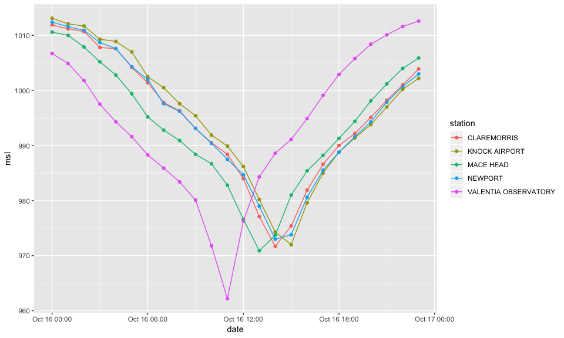
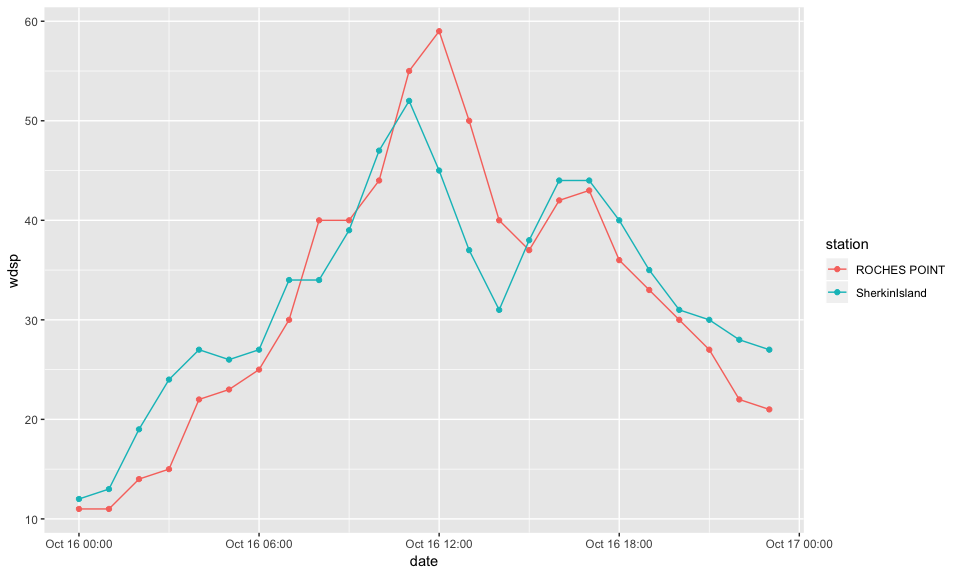

Example 2 - Exploring Storm Ophelia
================

The data set can be explored for specific events. For example, on
October 16th 2017, Storm Ophelia landed in Ireland. We can analyse this
data using **dplyr** and **ggplot2**. First, we load the libraries.

``` r
library(aimsir17)
library(dplyr)
library(ggplot2)
```

Next, we filter the observations for this date.

``` r
o <- observations %>%
  filter(month==10, day==16)
o
```

    ## # A tibble: 600 x 12
    ##    station  year month   day  hour date                 rain  temp  rhum
    ##    <chr>   <dbl> <dbl> <int> <int> <dttm>              <dbl> <dbl> <dbl>
    ##  1 ATHENRY  2017    10    16     0 2017-10-16 00:00:00   0.4   9.9    95
    ##  2 ATHENRY  2017    10    16     1 2017-10-16 01:00:00   0.3   9.9    95
    ##  3 ATHENRY  2017    10    16     2 2017-10-16 02:00:00   0.4   9.9    95
    ##  4 ATHENRY  2017    10    16     3 2017-10-16 03:00:00   0     9.8    95
    ##  5 ATHENRY  2017    10    16     4 2017-10-16 04:00:00   0.5   9.9    95
    ##  6 ATHENRY  2017    10    16     5 2017-10-16 05:00:00   0.1  10.5    96
    ##  7 ATHENRY  2017    10    16     6 2017-10-16 06:00:00   0    11.8    96
    ##  8 ATHENRY  2017    10    16     7 2017-10-16 07:00:00   0    12.4    94
    ##  9 ATHENRY  2017    10    16     8 2017-10-16 08:00:00   0    14.2    90
    ## 10 ATHENRY  2017    10    16     9 2017-10-16 09:00:00   0    16.6    72
    ## # … with 590 more rows, and 3 more variables: msl <dbl>, wdsp <dbl>,
    ## #   wddir <dbl>

Next, we can take a selection of stations that had the lowest
atmospheric pressure.

``` r
lowest <- o %>% arrange(msl) %>% 
  slice(1:6) %>% 
  pull(station) %>%
  unique()
lowest
```

    ## [1] "VALENTIA OBSERVATORY" "MACE HEAD"            "CLAREMORRIS"         
    ## [4] "KNOCK AIRPORT"        "NEWPORT"

This is then visualised using ggplot2

``` r
ggplot(filter(o,station %in% lowest),aes(x=date,y=msl,colour=station))+
  geom_point()+geom_line()
```

<!-- -->

The stations with the highest windspeed can be found

``` r
highest<- o %>% arrange(desc(wdsp)) %>% 
  slice(1:6) %>% 
  pull(station) %>%
  unique()
highest
```

    ## [1] "ROCHES POINT"  "SherkinIsland"

``` r
ggplot(filter(o,station %in% highest),aes(x=date,y=wdsp,colour=station))+
  geom_point()+geom_line()
```

<!-- -->
