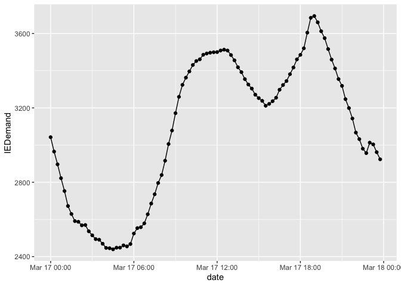
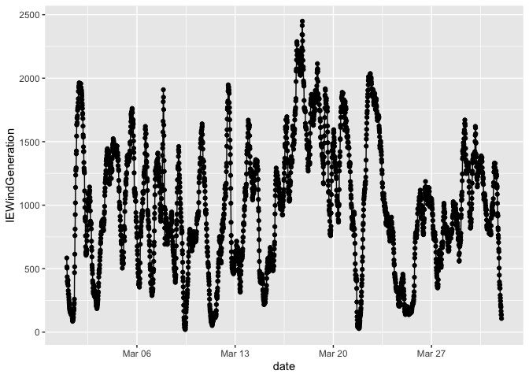

Example 4 - Exploring Energy Data
================

R tools such as **dplyr** and **tidyr** can be used to summarise data
(e.g. add rain observations to obtain monthly and annual cumulative
amounts). The three libraries are first loaded.

``` r
library(aimsir17)
library(dplyr)
library(tidyr)
library(ggplot2)
```

We can show eirgrid’s energy data from 2017, which is recorded at 15
minute intervals.

``` r
eirgrid17
```

    ## # A tibble: 35,040 x 15
    ##     year month   day  hour minute date                NIGeneration NIDemand
    ##    <dbl> <dbl> <int> <int>  <int> <dttm>                     <dbl>    <dbl>
    ##  1  2017     1     1     0      0 2017-01-01 00:00:00         889.     776.
    ##  2  2017     1     1     0     15 2017-01-01 00:15:00         922.     770.
    ##  3  2017     1     1     0     30 2017-01-01 00:30:00         908.     761.
    ##  4  2017     1     1     0     45 2017-01-01 00:45:00         919.     743.
    ##  5  2017     1     1     1      0 2017-01-01 01:00:00         882.     749.
    ##  6  2017     1     1     1     15 2017-01-01 01:15:00         849.     742.
    ##  7  2017     1     1     1     30 2017-01-01 01:30:00         843.     726.
    ##  8  2017     1     1     1     45 2017-01-01 01:45:00         809.     709.
    ##  9  2017     1     1     2      0 2017-01-01 02:00:00         797.     697.
    ## 10  2017     1     1     2     15 2017-01-01 02:15:00         755.     684.
    ## # … with 35,030 more rows, and 7 more variables: NIWindAvailability <dbl>,
    ## #   NIWindGeneration <dbl>, IEGeneration <dbl>, IEDemand <dbl>,
    ## #   IEWindAvailability <dbl>, IEWindGeneration <dbl>, SNSP <chr>

The variables stored for the eirgrid data include:

``` r
glimpse(eirgrid17)
```

    ## Rows: 35,040
    ## Columns: 15
    ## $ year               <dbl> 2017, 2017, 2017, 2017, 2017, 2017, 2017, 201…
    ## $ month              <dbl> 1, 1, 1, 1, 1, 1, 1, 1, 1, 1, 1, 1, 1, 1, 1, …
    ## $ day                <int> 1, 1, 1, 1, 1, 1, 1, 1, 1, 1, 1, 1, 1, 1, 1, …
    ## $ hour               <int> 0, 0, 0, 0, 1, 1, 1, 1, 2, 2, 2, 2, 3, 3, 3, …
    ## $ minute             <int> 0, 15, 30, 45, 0, 15, 30, 45, 0, 15, 30, 45, …
    ## $ date               <dttm> 2017-01-01 00:00:00, 2017-01-01 00:15:00, 20…
    ## $ NIGeneration       <dbl> 889.005, 922.234, 908.122, 918.802, 882.441, …
    ## $ NIDemand           <dbl> 775.931, 770.233, 761.186, 742.718, 749.238, …
    ## $ NIWindAvailability <dbl> 175.065, 182.866, 169.796, 167.501, 174.094, …
    ## $ NIWindGeneration   <dbl> 198.202, 207.765, 193.103, 190.757, 195.790, …
    ## $ IEGeneration       <dbl> 3288.57, 3282.12, 3224.27, 3171.27, 3190.28, …
    ## $ IEDemand           <dbl> 2921.44, 2884.19, 2806.38, 2718.77, 2682.91, …
    ## $ IEWindAvailability <dbl> 1064.79, 965.60, 915.35, 895.38, 1028.03, 114…
    ## $ IEWindGeneration   <dbl> 1044.72, 957.74, 900.46, 870.81, 998.31, 1119…
    ## $ SNSP               <chr> "28.4%", "26.4%", "25.2%", "24.7%", "27.9%", …

The given energy demand for a particular day can be viewed.

``` r
mar17 <- filter(eirgrid17,day==17, month==3)
ggplot(mar17,aes(x=date,y=IEDemand))+geom_point()+geom_line()
```

<!-- -->

The wind power generated for a month can be viewed

``` r
mar <- filter(eirgrid17,month==3)
ggplot(mar,aes(x=date,y=IEWindGeneration))+geom_point()+geom_line()
```

<!-- -->
