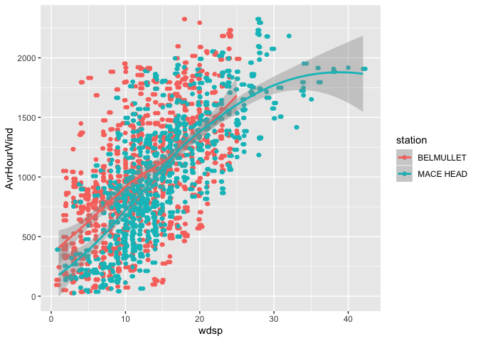

Example 4 - Exploring Energy Data
================

R tools such as **dplyr** and **tidyr** can be used to summarise data
(e.g. add rain observations to obtain monthly and annual cumulative
amounts). The three libraries are first loaded.

``` r
library(aimsir17)
library(dplyr)
library(tidyr)
library(ggplot2)
```

We can link the energyu data with the weather observations to explore
the link between wind speed and power generated. First, we use dplyr to
get the hourly mean of wind power generated for March 2017

``` r
march <- eirgrid17 %>% filter(month==3) %>%
                       group_by(year,month,day,hour) %>%
                       summarise(AvrHourWind=mean(IEWindGeneration))
march
```

    ## # A tibble: 743 x 5
    ## # Groups:   year, month, day [31]
    ##     year month   day  hour AvrHourWind
    ##    <dbl> <dbl> <int> <int>       <dbl>
    ##  1  2017     3     1     0        509.
    ##  2  2017     3     1     1        395.
    ##  3  2017     3     1     2        351.
    ##  4  2017     3     1     3        282.
    ##  5  2017     3     1     4        211.
    ##  6  2017     3     1     5        168.
    ##  7  2017     3     1     6        167.
    ##  8  2017     3     1     7        145.
    ##  9  2017     3     1     8        137.
    ## 10  2017     3     1     9        117.
    ## # … with 733 more rows

Next, get the weather observations for March for two stations (Mace Head
and
Belmullet)

``` r
w <- observations %>% filter(month==3, station=="MACE HEAD" | station == "BELMULLET") %>% 
                 select(station, year, month, day, hour, wdsp)
w
```

    ## # A tibble: 1,488 x 6
    ##    station    year month   day  hour  wdsp
    ##    <chr>     <dbl> <dbl> <int> <int> <dbl>
    ##  1 BELMULLET  2017     3     1     0     9
    ##  2 BELMULLET  2017     3     1     1     9
    ##  3 BELMULLET  2017     3     1     2     8
    ##  4 BELMULLET  2017     3     1     3     9
    ##  5 BELMULLET  2017     3     1     4     8
    ##  6 BELMULLET  2017     3     1     5     8
    ##  7 BELMULLET  2017     3     1     6     7
    ##  8 BELMULLET  2017     3     1     7     5
    ##  9 BELMULLET  2017     3     1     8     6
    ## 10 BELMULLET  2017     3     1     9     3
    ## # … with 1,478 more rows

Next, join the two tables.

``` r
j <- full_join(w, march)
```

    ## Joining, by = c("year", "month", "day", "hour")

``` r
j
```

    ## # A tibble: 1,488 x 7
    ##    station    year month   day  hour  wdsp AvrHourWind
    ##    <chr>     <dbl> <dbl> <int> <int> <dbl>       <dbl>
    ##  1 BELMULLET  2017     3     1     0     9        509.
    ##  2 BELMULLET  2017     3     1     1     9        395.
    ##  3 BELMULLET  2017     3     1     2     8        351.
    ##  4 BELMULLET  2017     3     1     3     9        282.
    ##  5 BELMULLET  2017     3     1     4     8        211.
    ##  6 BELMULLET  2017     3     1     5     8        168.
    ##  7 BELMULLET  2017     3     1     6     7        167.
    ##  8 BELMULLET  2017     3     1     7     5        145.
    ##  9 BELMULLET  2017     3     1     8     6        137.
    ## 10 BELMULLET  2017     3     1     9     3        117.
    ## # … with 1,478 more rows

Next, summarise the merged data set

``` r
summary(j)
```

    ##    station               year          month        day    
    ##  Length:1488        Min.   :2017   Min.   :3   Min.   : 1  
    ##  Class :character   1st Qu.:2017   1st Qu.:3   1st Qu.: 8  
    ##  Mode  :character   Median :2017   Median :3   Median :16  
    ##                     Mean   :2017   Mean   :3   Mean   :16  
    ##                     3rd Qu.:2017   3rd Qu.:3   3rd Qu.:24  
    ##                     Max.   :2017   Max.   :3   Max.   :31  
    ##                                                            
    ##       hour            wdsp        AvrHourWind     
    ##  Min.   : 0.00   Min.   : 1.00   Min.   :  25.57  
    ##  1st Qu.: 5.75   1st Qu.: 9.00   1st Qu.: 634.31  
    ##  Median :11.50   Median :13.00   Median : 964.73  
    ##  Mean   :11.50   Mean   :13.45   Mean   :1002.10  
    ##  3rd Qu.:17.25   3rd Qu.:18.00   3rd Qu.:1356.49  
    ##  Max.   :23.00   Max.   :42.00   Max.   :2325.20  
    ##                                  NA's   :2

Finally, explore any possible relationship between average hourley wind
speed and average wind power
generated

``` r
ggplot(j,aes(x=wdsp,y=AvrHourWind,colour=station))+geom_point()+geom_jitter()+geom_smooth()
```

    ## `geom_smooth()` using method = 'loess' and formula 'y ~ x'

    ## Warning: Removed 2 rows containing non-finite values (stat_smooth).

    ## Warning: Removed 2 rows containing missing values (geom_point).
    
    ## Warning: Removed 2 rows containing missing values (geom_point).

<!-- -->
