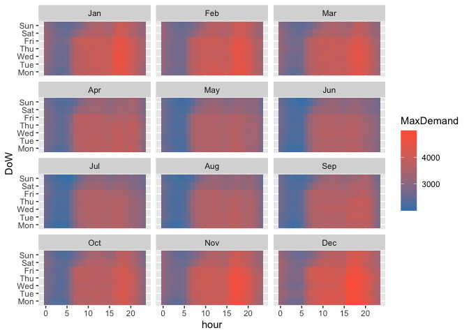

Example 6 - Heatmap of Energy Demand
================

R tools such as **dplyr** and **tidyr** can be used to summarise data
(e.g. add rain observations to obtain monthly and annual cumulative
amounts). The three libraries are first loaded.

``` r
library(aimsir17)
library(dplyr)
library(tidyr)
library(ggplot2)
library(lubridate)
```

First, we summarise the demand by hour of day, and day of the week

``` r
demand <- eirgrid17 %>% 
            mutate(DoW=wday(date,label = T),
                   Month=month(date,label=T)) %>%
            group_by(DoW,hour,Month) %>%
            summarise(MaxDemand=max(IEDemand)) %>%
            ungroup() %>%
            mutate(DoW=factor(DoW,
                              levels = c("Mon","Tue", "Wed","Thu","Fri","Sat","Sun")))
```

``` r
ggplot(demand, aes(hour, DoW)) +
 geom_tile(aes(fill = MaxDemand))+scale_fill_gradientn(colours = c("steelblue", "tomato"))+facet_wrap(~Month,ncol=3)
```

<!-- -->
